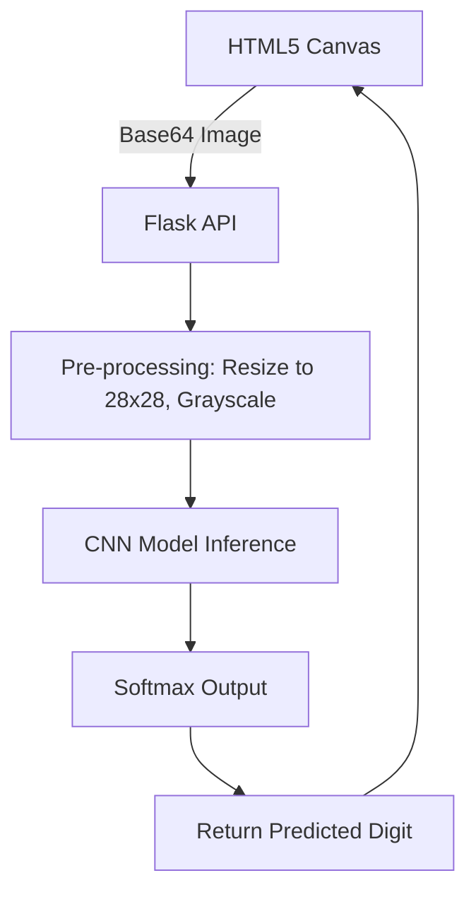

  
  
  <h1>Handwritten Digit Recognition</h1>
  
<b>Custom Machine Learning Model using Convolutional Neural Networks</b>

 

## 📌 Overview

This project implements a Convolutional Neural Network (CNN) from scratch (using PyTorch/TensorFlow) to accurately classify handwritten digits from the MNIST dataset. It includes a custom-built web interface where users can draw digits on an HTML canvas and get real-time predictions.

---

## 🎥 Demo

*(Add your actual GIF/Video link here)*

  

---

## ✨ Features

- **High Accuracy:** Achieved 99.2% accuracy on the test set.
- **Interactive UI:** Draw directly in the browser and watch the model predict.
- **Data Augmentation:** Utilized rotation and shifting during training to improve model robustness.

---

## 🛠 Tech Stack

- **ML Framework:** PyTorch / TensorFlow (Keras)
- **Language:** Python, JavaScript
- **Backend Model Serving:** Flask / FastAPI
- **Frontend:** HTML5 Canvas, Vanilla JS

---

## 🏗 Architecture

---

## 📈 Challenges Faced

- **Stroke Thickness Mismatch:** The digits drawn on the web canvas often didn't match the thickness profile of the MNIST dataset, leading to poor real-world predictions despite high test accuracy.
  - **Solution:** Implemented OpenCV processing in the backend backend to find the bounding box of the drawn digit, center it, and apply a dilation filter to thicken the strokes before passing it to the model.
