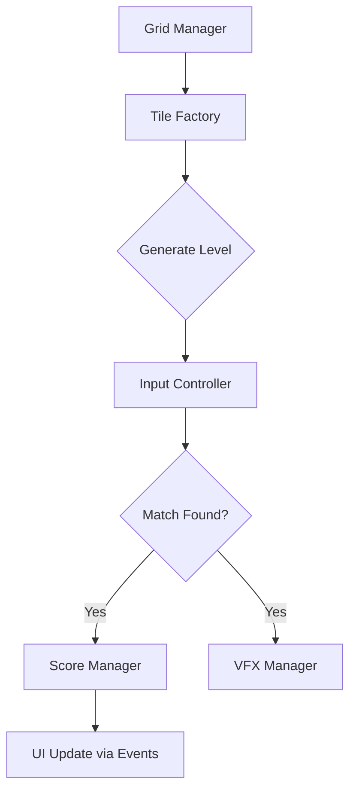

  
  
  <h1>Match'em All</h1>
  
<b>Vibrant Tile-Matching Game Optimized for Performance</b>

 

## 📌 Overview

**Match'em All** is a visually vibrant tile-matching puzzle game designed for casual mobile gamers. The core focus was on creating a highly responsive and satisfying player experience with scalable mechanics.

---

## 🎥 Demo

*(Add your actual GIF/Video link here)*

  

---

## ✨ Features

- **Juicy Feedback:** Screen shakes, particle bursts, and satisfying audio cues on every match.
- **Dynamic Board Generation:** Algorithmic level generation ensuring solvable puzzles.
- **Performance Optimized:** Runs at 60 FPS on low-end Android devices.

---

## 🛠 Tech Stack

- **Game Engine:** Unity
- **Language:** C#
- **Patterns:** Observer Pattern (for UI updates), Factory Pattern (for tile generation).

---

## 🏗 Architecture

---

## 📈 Challenges Faced

- **Recursive Match Checking:** Initially, checking for large combo matches caused recursive stack overflows.
  - **Solution:** Rewrote the match-checking algorithm to use an iterative Breadth-First Search (BFS) approach instead of recursion.
