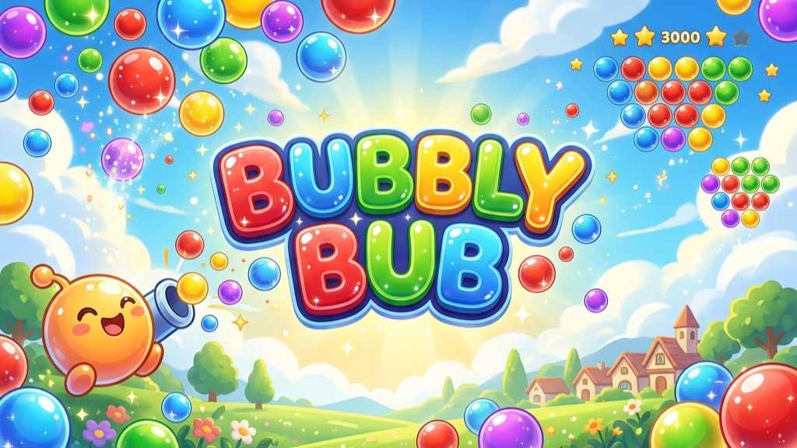
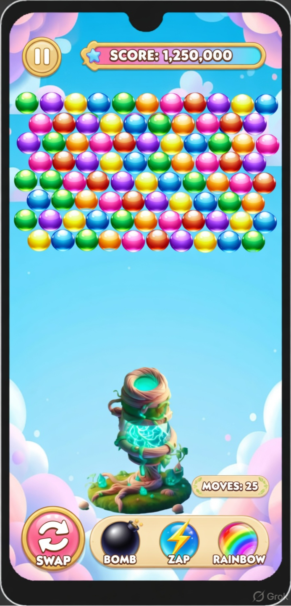
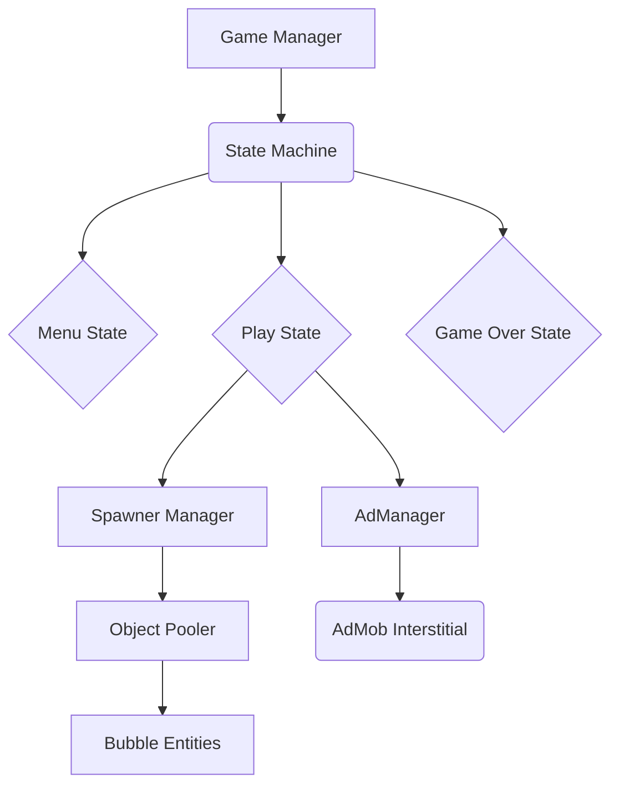

<div align="center">
  
  
  <h1>Bubbly Bub</h1>
  <p><b>A highly engaging hyper-casual game with addictive mechanics</b></p>

  <a href="https://play.google.com/store/apps/details?id=com.yourcompany.bubblybub">
    
  </a>
</div>

<br/>

## 📌 Overview

**Bubbly Bub** is a fast-paced hyper-casual mobile game designed to test player reflexes and timing. Players tap to pop matching bubbles while avoiding obstacles, trying to survive as long as possible. The game features an infinite scaling difficulty curve, vibrant particle effects, and an integrated leaderboard system.

---

## 🎥 Demo

*(Add your actual GIF/Video link here)*
<div align="center">
  <video width="80%" autoplay loop muted playsinline>
    <source src="../Assets/BubblyBub_ad1.mp4" type="video/mp4">
  </video>
</div>

---

## 📸 Screenshots

<p align="center">
<td width="50%">

</td>
<td width="50%">

</td>  &nbsp;&nbsp;
  
</p>

---

## ✨ Features

- **Infinite Core Loop:** Difficulty ramps up infinitely based on survival time.
- **Haptic Feedback:** Satisfying vibrations integrated with bubble pops for better game feel.
- **Global Leaderboards:** Google Play Games Services integration for competitive play.
- **Monetization:** AdMob integration (Banner and Interstitial ads).
- **Analytics:** Firebase Analytics to track player drop-off points and session lengths.

---

## 🛠 Tech Stack

- **Game Engine:** Unity 2022.3 LTS
- **Language:** C#
- **Services:** Firebase (Analytics/Crashlytics), Google Play Games Services
- **Monetization:** Google AdMob SDK

---

## 🏗 Architecture

The game utilizes a **State Pattern** for managing game flow and an **Object Pooling** system to maintain steady 60 FPS on lower-end devices.



---

## 📂 Folder Structure

```text
Assets/
├── 📁 Scripts/
│   ├── 📁 Core/          # GameManager, StateMachine
│   ├── 📁 Entities/      # BubbleController, PlayerInput
│   ├── 📁 Systems/       # ObjectPooler, AudioSystem
│   └── 📁 Services/      # AdManager, FirebaseInit
├── 📁 Prefabs/           # Pre-configured game objects
├── 📁 Scenes/
│   ├── MainMenu.unity
│   └── GameScene.unity
└── 📁 Art/               # Sprites, Materials, Particles
```

---

## 🚀 How to Run
*This is a closed-source commercial product. The production build is available on the Google Play Store.*

---

## ⏱️ Development & Production

- **Development Time:** ~3 Weeks
- **Analytics Integration:** Firebase was used to track `level_failed` events to adjust the difficulty curve. Found that 40% of players failed at the 45-second mark, leading to a slight tuning of spawn rates.
- **Closed Testing:** Ran a 14-day closed beta with 20 users. Received feedback that particles were too distracting, leading to a toggle feature in settings.

---

## 📈 Challenges Faced

1. **Garbage Collection Spikes:** Initially, destroying and instantiating bubbles caused noticeable lag spikes on mobile devices.
   - **Solution:** Implemented a robust Object Pooling system, reusing deactivated bubbles instead of destroying them. This completely eliminated GC stutters.
2. **AdMob Initialization Delay:** Ads wouldn't load fast enough for the first Game Over screen.
   - **Solution:** Pre-loaded the interstitial ad silently during the main menu state.

---

## 💡 What I Learned

- **Mobile Optimization:** Deep dive into Unity Profiler to understand draw calls and overdraw caused by transparent particles.
- **Retention Mechanics:** Learned that simply adding a High Score tracker increased average session length by 2 minutes.

---

## 🔮 Future Improvements

- Add daily challenges with specific modifiers (e.g., "Double speed bubbles").
- Implement a skin-shop using in-game currency.
- Transition from standard AdMob to Unity LevelPlay (IronSource) for better mediation.
