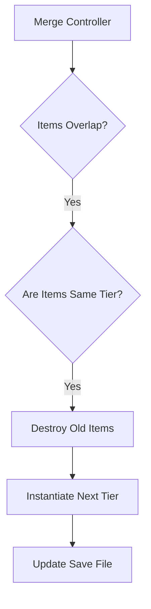

  
  
  <h1>Merge'em All</h1>
  
<b>Satisfying Puzzle Game Focused on Infinite Progression</b>

 

## 📌 Overview

**Merge'em All** is a merge puzzle game where players combine identical items to create higher-tier objects. 

---

## 🎥 Demo

  

---

## ✨ Features

- **Infinite Progression:** Combine items infinitely to unlock rare tiers.
- **Offline Earnings:** Idle mechanics allow players to earn currency while away.
- **Daily Quests:** Integrated quest system to boost D1 and D7 retention.

---

## 🛠 Tech Stack

- **Game Engine:** Unity
- **Language:** C#
- **Saving System:** Custom JSON serialization for save states.

---

## 🏗 Architecture

---

## 📈 Challenges Faced

- **Save File Corruption:** Players closing the app mid-merge could corrupt the JSON save state.
  - **Solution:** Implemented a dual-save system (backup + main) and only wrote to disk during stable idle states.
