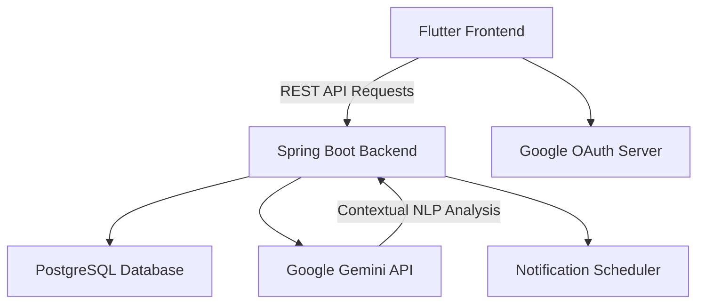

  
  
  <h1>StratGo AI</h1>
  
<b>Smart Personal Assistant & Productivity Application</b>

 

## 📌 Overview

**StratGo AI** is a full-stack, AI-powered productivity application designed to act as a smart personal assistant. It leverages the Google Gemini API to enable conversational task creation, intelligent scheduling, and seamless integration with calendar systems.

---

## 🎥 Demo

  

---

## ✨ Features

- **Conversational Task Management:** Create, edit, and delete tasks simply by chatting with the AI.
- **Contextual Scheduling:** The AI understands your calendar and chat history to suggest the optimal times for tasks.
- **Background Notifications:** Robust background scheduling to ensure you never miss a deadline.
- **Secure Authentication:** Integrated Google OAuth for seamless and secure user login.

---

## 🛠 Tech Stack

- **Frontend:** Flutter, Dart
- **Backend:** Java, Spring Boot
- **Database:** PostgreSQL
- **AI Integration:** Google Gemini API
- **Deployment & Auth:** Docker, Google OAuth, REST APIs

---

## 🏗 Architecture

---

## 📈 Challenges Faced

1. **Context Window Management:** Keeping track of the user's schedule across long conversational interactions with the Gemini API without exceeding token limits.
   - **Solution:** Implemented a rolling context window in the Spring Boot backend that summarizes past interactions and only feeds the immediate upcoming calendar events to the LLM.
2. **Cross-Platform Background Tasks:** Ensuring background notifications fired reliably on both iOS and Android via Flutter.
   - **Solution:** Utilized native platform channels to tie the Spring Boot scheduling triggers directly into the OS-level alarm managers.

---

## 💡 What I Learned

- Designing robust microservice-oriented architectures using Spring Boot and Docker.
- Advanced prompt engineering with the Gemini API to force strictly structured JSON responses for task creation.
- Seamlessly bridging a Dart/Flutter UI with a Java backend.
